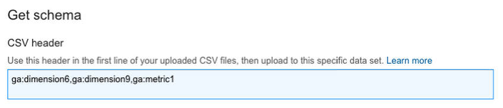

# Tutorial: Create a Remarketing List with Predictive Analytics 

In this tutorial, you will learn how to create a predictive model for customer
conversion based on a combination of in-house CRM data and Google Analytics
Premium logs. It consists of an initial code lab using pre-generated sample
data, followed by a detailed implementation guide that shows you how to put
predictive analytics into practice using your own data.

The material in this repository complements [an article](https://cloud.google.com/solutions/google-analytics-bigquery) introducing the topic on the Google Cloud Platform Solutions website. 


You will start by diving into the deep-end and use the 
[R](http://www.r-project.org/) statistics software to generate a report of how 
probable it is to make a conversion for a given customer based on website 
behaviour. This will be a step-by-step code-lab which aims to  give you a solid 
grounding in some of the statistical methods you can incorporate into your own 
predictive analytics. Hopefully, it will also whet your appetite for 
implementing this using your own Google Analytics Premium and CRM data.

Following the code lab, you can move onto the detailed implementation guide
showing you how to analyze your own Google Analytics Premium logs using the
powerful capabilities of BigQuery. The implementation guide will walk you
through the required steps to:

  * setup your website to capture the all-important Google Analytics Client ID
  * use BigQuery to generate your own training dataset for creating a statistical
model
  * create a [remarketing](https://support.google.com/adwords/answer/2453998?hl=en) list based on your statistical predictive model, again using the power of
BigQuery
  * create an AdWords audience that will target only the website visitors that are
more likely to convert into a sale

If you're all set to go, dive into the code lab to build a statistical model.

## Code Lab: Create a Remarketing List with Predictive Analytics

In this code lab you will analyze a sample dataset and create a predictive
statistical model based on a combination of CRM and website log data. You will
be using the R software to analyze the sample data.

### Before you Start

The code lab makes some assumptions about your skills and experience. These are
not strict requirements, but ideally, you will have some experience using R and
a basic understanding of statistical concepts like [correlation](https://en.wikipedia.org/wiki/Correlation_and_dependence) and [regression](https://en.wikipedia.org/wiki/Logistic_regression).

Follow these steps to setup R on your platform if you do not already have an R
environment available:

  1. Download and install R for your platform using [these installation instructions](http://cran.rstudio.com/). The Code Lab was developed and tested using R v3.2.1., but a later version
should work as well.
  2. Install the required R packages by following these steps:
     * Start your R interactive environment by executing the `R` command 
     * Run the following commands on the interactive prompt

```
> install.packages("ggplot2")
> install.packages("ROCR")
> install.packages("car")
> install.packages("rms")
```

### The Code Lab Scenario

The example scenario is that of a car dealership chain with showrooms across
the nation. Your company website provides general information and advertises
your latest promotions, but all actual car sales happen in-person in one of
your showrooms. Wouldn't it be great if you could find out which website
visitors are most likely to visit your showroom and take a test drive if you
reach out to them?

Conveniently, the internal company CRM system has a field, `customer_level`, that records the level of engagement the customer has had with the company to
date. A value of 3, for example, means that the customer has been on a test
drive. A value of 5 means that the customer has made a car purchase.

In an attempt to analyse this existing data and better understand how their
website has affected customers' decisions and behaviour in the past, the
company has linked their historical Google Analytics Premium log data and the
relevant CRM customer records together. They now want to build a statistical
model from the historical data, with the aim of using this model to predict
future  behaviour and prioritise remarketing efforts towards website visitors
who seem most likely to further engage based on their web browsing on the
corporate website.

To this end, the company has added a field in the CRM called `CV_flag` to indicate whether a customer has at least taken a test drive. In other
words, `CV_flag` will be `1` if the `customer_level` is `3` or higher, and `0` otherwise. They have created a set of training data based on historical GAP
logs linked to specific customers in the CRM, including the `CV_flag` variable, and now it is your job to take this data and build a statistical
model (in the implementation guide you will learn how to create this type of
training data using your own data).

### Building the model

This model hinges on a binary outcome. Either the customer converts and at
least books a test drive (success) or they don't (failure). To model this
scenario, you will build a statistical model using [logistic regression](https://en.wikipedia.org/wiki/Logistic_regression) analysis to predict the likelihood of a conversion.

The formal model can be defined as follows:


  * *Y<sub>i</sub>* is the objective variable, in this case the conversion success or failure
for each customer, *i*
  * *X<sub>i</sub>* is the explanatory variable
  * *alpha* is the intercept and *beta<sub>i</sub>* are the regression coefficients
  * *p<sub>i</sub>* is predicting the conversion rate, which will be used in the remarketing
list

The sample data has been provided in `sample_data/train_data.csv.`If you open the file to have a look, you will see that it contains comma
separated values (CSV) where the first line contains the header information for
each column. (After completing this code lab you will learn how to create this
type of file using your own data)

The first two fields, `a_fullVisitorId` and `a_hits_customDimensions_value` are unique IDs that are generated by Google Analytics Premium to identify a
specific client device (Client ID). The next fields from `a_COUNT` to `a_page201406` are Google Analytics Premium fields that the data analysts deemed potentially
relevant to the model. And finally, `b_hits_customDimensions_value` provides the CRM link back to the Google Analytics Premium data and `b_CV_flag` refers to the conversion flag for that customer. You can find detailed
descriptions for all Google Analytics Premium fields [here](https://support.google.com/analytics/answer/3437719?hl=en). 

Enough with the build-up, let's run some code! Open your R interactive
execution environment so that you see a `>` prompt, typically by running the following command from the root folder of the
cloned github repository:


```
$ R
```
If your R execution environment is different, run the commands in the manner
that you usually run interactively with your R installation.

First, you need to read the data in the `train_data.csv` file and check that the correct columns have been imported. Execute the
commands below to save the sample data in the variable `data1` (Do not enter the `>`, it only represents the interactive R prompt):


```
> data1 <- read.csv("./sample_data/train_data.csv")
> names(data1)
```
You should see 23 columns at this point. Some of these columns are probably not
relevant to the statistical model. Specifically, you can remove the `a_fullVisitorId`, `a_hits_customDimensions_value`, `a_mobile_flag` and `b_hits_customDimensions_value`, or  columns number 1, 2, 12 and 22. To do so, run the following command that
removes these columns from the variable `data1`.


```
> data1 <- data1[c(-1,-2,-12,-22)]
```
Based on this data, you can now generate correlation coefficients for each pair
of variables. The correlation coefficients tell you how correlated two
variables are where a value of 1 or -1 means they are perfectly positively or
negatively correlated. A value of 0 means they are completely uncorrelated. For
this model, you will select 0.9 as the upper threshold. The commands below
outputs the correlation coefficients for each variable pair.


```
> cor(data1)
```
Let's group correlations and assign them ASCII symbols in the output so we can
see which ones are most interesting. 


```
> symnum(abs(cor(data1)),cutpoints = c(0, 0.2, 0.4, 0.6, 0.9, 1), symbols = c(" ", ".", "_", "+", "*"))
```
Look for the `*` symbol to indicate a value higher than 0.9. Note that each variable's own
coefficient is always `1`, so don't remove all the stars. Below is an extract from the sample data, showing two examples of strong
correlation coefficients. 


```
                        a_SUM_totals_hits
a_SUM_totals_pageviews  0.954889672

                        a_diffdays_oldest
a_diffdays_latest       0.968898001
```
Based on this, you should exclude one of each pair, in this case `a_SUM_totals_hits` and `a_diffdays_oldest` from the model. This is easily done using R using the following command. The `data1` variable now no longer contains columns 3 and 7:

```
> data1 <- data1[c(-3,-7)]
```
If you were to run through with this data to the end, you would find that the
regression coefficient for the `a_midnight_flag` variable would be undefined when running the model. So in the interest of time
you can remove this variable from the data by running the following command.


```
> data1 <- data1[,c(-13)]
```
### Run the Regression

In this step, you will run the regression. You will use the R function `glm` to perform the logistic regression by specifying a binomial distribution (`family=binomial`). You can generate the initial model and print the results to the screen with
the following commands. Note the use of `b_CV_flag` as the objective variable:

```
> model <- glm(formula = b_CV_flag ~., data = data1, family = binomial("logit"))
> result <- summary(model)
> result
```

This shows the estimated coefficients. Before you accept this model, however,
you should check for multicollinearity, dependencies between three or more
variables. To do this, you can use the `vif` function and see if any variables have a VIF (Variables Inflation Factor) of
more than 10. If so, you should also exclude those variables from the analysis.
For this function to work, you'll need to load a couple of the previously
installed libraries.


```
> library(car)
> library(rms)
> vif(model)
```
You should see that two variables have a value of more than 10, `a_SUM_totals_pageviews` (over 30) and `a_SUM_hits_hitNumber` (over 27). In other words, multicollinearity occurs. Therefore, you should
delete one of the variables, in this case `a_SUM_totals_pageviews`, and rerun the logistic analysis giving the data set and model a new name, `data1_2` and `model1_2` respectively.


```
> data1_2 <- data1[,c(-2)]
> model1_2 <- glm(formula = b_CV_flag ~., data = data1_2, family = binomial("logit"))
> result1_2 <- summary(model1_2)
> result1_2
```
Below is the result output, showing the estimated model. The estimated
coefficients are listed in the column `Estimate` for each of the included variables.


```
Call:
glm(formula = b_CV_flag ~ ., family = binomial("logit"), data = data1_2)

Deviance Residuals:
    Min       1Q   Median       3Q      Max
-2.0110  -0.5281  -0.2039  -0.0923   3.2817

Coefficients:
                          Estimate Std. Error z value Pr(>|z|)
(Intercept)             -2.3298773  1.3069659  -1.783   0.0746 .
a_COUNT                  0.0578391  0.2152773   0.269   0.7882
a_SUM_totals_timeOnSite -0.0004421  0.0003392  -1.303   0.1924
a_SUM_hits_hitNumber     0.0389365  0.0433719   0.898   0.3693
a_diffdays_latest       -0.1301964  0.0110120 -11.823   <2e-16 ***
a_desktop_flag           0.9450177  1.1271481   0.838   0.4018
a_tablet_flag            2.9104792  1.3544122   2.149   0.0316 *
a_OS_Windows_flag        1.0340938  0.9495262   1.089   0.2761
a_OS_Macintosh_flag      0.8657634  1.0523633   0.823   0.4107
a_SUM_morning_visit      0.3425241  0.2438371   1.405   0.1601
a_SUM_daytime_visit      0.2992608  0.2228069   1.343   0.1792
a_SUM_evening_visit      0.2578074  0.2488274   1.036   0.3002
a_page201404             0.3279693  0.3790867   0.865   0.3870
a_page201405             1.0019170  0.5065072   1.978   0.0479 *
a_page201406            -1.3596393  1.2626093  -1.077   0.2815
---
Signif. codes:  0 '***' 0.001 '**' 0.01 '*' 0.05 '.' 0.1 ' ' 1

(Dispersion parameter for binomial family taken to be 1)

    Null deviance: 1062.20  on 1294  degrees of freedom
Residual deviance:  758.65  on 1280  degrees of freedom
AIC: 788.65

Number of Fisher Scoring iterations: 7
```
Run the VIF function again to check for multicollinearity, and the output
should now show that there are no variables with VIF values over 10.


```
> vif(model1_2)
```
### Verify the Model Accuracy (Gain and ROC)

One way to evaluate the value of a predictive model is to generate a cumulative
Gain chart. Simply put, it visually shows the gain in response from using the
predictive model as opposed to remarketing randomly across the customer
database. The larger the distance between the Gain line and the baseline the
better the predictive model is. To generate the Gain chart in R you will need
to run the following commands.


```
> prob <- data.frame(predict(model1_2, data1_2, type = "response"))
> gain <- cumsum(sort(prob[, 1], decreasing = TRUE)) / sum(prob)
> png('gain_curve_plot.png')
> plot(gain,main ="Gain chart",xlab="number of users", ylab="cumulative conversion rate")
> dev.off()
```
This saves the Gain chart as a PNG file called `gain_curve_plot.png` in your local directory. It should look like this:


The ROC (Receiver Operating Characteristic) curve, is normalized from the gain
chart. Here, the value of AUC (the area under the ROC curve) becomes the
indicator of the goodness of the performance of the classification algorithm.
It takes a value between zero and one, where 0.5 would be random and a higher
number would indicate a better model than randomness. You can generate the
curve by running the R commands below.

 


```
> pred <- prediction(prob, data1_2$b_CV_flag)
> perf <- performance(pred, measure = "tpr", x.measure = "fpr")
> qplot(x = perf@x.values[[1]], y = perf@y.values[[1]], xlab = perf@x.name, ylab = perf@y.name, main="ROC curve")
> dev.off()
```
It saves the output graph in a PDF file named `Rplots.pdf` in your local directory or opens a new window depending on which R tool you
use. Either way, it should look like this.


Check the model in R using an alternative function, `lrm` (logistic regression model):


```
> Logistic_Regression_Model <- lrm(b_CV_flag ~., data1_2)
> Logistic_Regression_Model
```
Check the AIC (An Information Criteria) of the two models. A smaller number
indicates a better model.


```
> AIC(model)
> AIC(model1_2)
```
As expected, the later model has a lower number and appears to be the better
model. Use that model to create a simple coefficient list of all the variables.
To do so, run the following commands to parse the data from `model1_2` into
something easy to copy and paste:

```
> coef <- names(model1_2$coefficient)
> value <- as.vector(model1_2$coefficient)
> result <- data.frame(coef, value)
> result

                      coef         value
1              (Intercept) -2.3298773233
2                  a_COUNT  0.0578391477
3  a_SUM_totals_timeOnSite -0.0004420572
4     a_SUM_hits_hitNumber  0.0389364789
5        a_diffdays_latest -0.1301964399
6           a_desktop_flag  0.9450177277
7            a_tablet_flag  2.9104792404
8        a_OS_Windows_flag  1.0340938208
9      a_OS_Macintosh_flag  0.8657633791
10     a_SUM_morning_visit  0.3425240801
11     a_SUM_daytime_visit  0.2992608455
12     a_SUM_evening_visit  0.2578073685
13            a_page201404  0.3279692978
14            a_page201405  1.0019169671
15            a_page201406 -1.3596393104
```
Congratulations! You've successfully completed a statistical model based on
historic data and come to the end of this code lab. But there's plenty more to
learn in the next section where you will see a detailed implementation guide
for how you can apply this approach to your own data. You will also learn how
to take the coefficient values you generated in R and apply them to your
visitor dataset in BigQuery to generate a remarketing list. 

All the commands are also provided in the `gap-bq-regression.r` file. To execute this script, run the following command (assuming that you are
running it from the base of the sample code):


```
$ Rscript gap-bq-regression.r
```
If your R execution environment is different, run the `gap-bq-regression.r` scripts in the way you normally run r scripts. Running the script is the
equivalent the step-by-step interactive execution you just performed.

# Implementation Guide

Hopefully you've been able to complete the code lab and are now ready to learn
more about how to implement predictive analytics with Google Analytics Premium,
BigQuery and R using your own data. In this implementation guide you will get a
step by step view on what to do, as well as helpful templates to get you
started.

You'll go through these main steps:


## Step 1: Setup Google Analytics Premium and your Website

Before you can start implementing the predictive analytics, you need to have
all these following preliminary steps completed:

  * <strong>Sign up for Google Analytics Premium</strong>: Submit [the signup form](http://www.google.com/analytics/premium/contact.html) and our sales representative will walk you through the subscription process.
After completing the process, you will receive a notification from the sales
representative that you have successfully been signed up for Google Analytics
Premium
  * <strong>Configure your website to use Google Analytics:</strong> If you're not using Analytics on your website already, [you need to enable it](https://support.google.com/analytics/answer/1008015?hl=en)
  * <strong>Create a new project and open the BigQuery Browser tool:</strong> Open the [Google Developers Console](https://console.developers.google.com/) and press [Create Project]. Open the project and click [Big Data] - [BigQuery]
menu to launch the BigQuery Browser tool and take note of your Project ID
  * <strong>Reach out to your Google Analytics Premium Account Manager to submit a BigQuery
export request with your Project ID</strong>: Your account manager will take care of your BigQuery export request and will
give you a monthly credit of USD 500 towards usage of BigQuery for this project
  * <strong>That's it!</strong> You will see your Google Analytics logs imported into your project several
times per day, with BigQuery tables named <em>ga_sessions_YYYYMMDD</em>

### Creating an Entry Form to Capture Client ID

You have at least two data sources: Google Analytics Premium logs and your own
CRM or similar customer-based data. To link the two data sets, you need to have
a unique key in both places to match a customer in your CRM with the web
visitor that is browsing your website. The key you should use is called [Client ID](https://developers.google.com/analytics/devguides/collection/analyticsjs/domains) and is a unique key that is generated by Google Analytics Premium based on the
cookie information of the visitor. This idea is illustrated below:


The question, then, is how do you get this Client ID inserted into your CRM
database? One common approach is to set up a form on your website where
visitors enter information, such as their name and email address, along with a
hidden field for Client ID, and then save that information in your internal CRM
database. By saving the same unique ID in Google Analytics you can tie the two
records together. It is important to note that you should [never save personally identifiable information (PII)](https://support.google.com/analytics/answer/2795983?hl=en) in Google Analytics, just the <em>Client ID</em>.

### Add Google Analytics Client ID to HTML Entry Form

To achieve this in practice, your simple HTML entry form might look something
like the below HTML snippet on your website, where the `/formComplete` action will perform the necessary steps to save this information in your CRM
system. 


```
<form id="lead-form" method="POST" action="/formComplete">
	<input id="email" type="text"/>
	<input id="name" type="text"/>
	. . .
	<input id="clientId" type="hidden"/>
	<input type="submit" value="Submit"/>
</form>
```
The key here is the hidden input field called `clientId`. With just the HTML form element, this value would be empty when the visitor
submits the form. Therefore, you will need to add some JavaScript code on your
web page that will trigger when the visitor submits the `lead-form` and inserts the value:

```
<script>
document.getElementById('lead-form').addEventListener(
  'submit', function(event) {
  ga(function(tracker) {
    clientId = tracker.get('clientId');
    document.getElementById('clientId').value = clientId;
    tracker.send('event', 'online form', 'submit', {
      'dimension6': clientId
  });
  }); });
</script>
```

The three key lines are:

```
    clientId = tracker.get('clientId');
    document.getElementById('clientId').value = clientId;
    tracker.send('event', 'online form', 'submit', {
      'dimension6': clientId
```

  * Line 1 gets the `clientId` value, a unique identifier assigned to this website visitor, from the Google
Analytics `tracker` object
  * Line 2 sets the hidden form field you just created to the value of `clientId`

So when the website visitor submits the entry form, the unique `clientId` identifier is saved in your CRM database.

  * Line 3 saves the `clientId` as a custom dimension (`dimension6`) in Google Analytics

You may be wondering what the `dimension6` element in the last line refers to. Google Analytics allows for custom
data chosen by you to be added to its log entries, and call these [*custom dimensions*](https://developers.google.com/analytics/devguides/collection/analyticsjs/custom-dims-mets). The number represents the index of the particular dimension, index 6 in this
case. If you are using multiple dimensions in your Google Analytics already,
you may choose another index, for example `dimension7` instead.

Since you are using hit level custom dimensions you also need a way of injecting the `clientId` into every page view on your website. Otherwise, Google Analytics Premium will not store this value for each hit. A sample script is provided below, but you should adapt this to fit your site, if necessary. See the [developer guide](https://developers.google.com/analytics/devguides/collection/analyticsjs/custom-dims-mets) for examples of different approaches you can take. This example [Google Analytics snippet](https://developers.google.com/analytics/devguides/collection/analyticsjs/) sets the `clientId` for every page view in the custom dimension `dimension6`:

```
<script>
  (function(i,s,o,g,r,a,m){i['GoogleAnalyticsObject']=r;i[r]=i[r]||function(){
  (i[r].q=i[r].q||[]).push(arguments)},i[r].l=1*new Date();a=s.createElement(o),
  m=s.getElementsByTagName(o)[0];a.async=1;a.src=g;m.parentNode.insertBefore(a,m)
  })(window,document,'script','//www.google-analytics.com/analytics.js','ga');

  ga('create', 'UA-XXXXX-Y', 'auto');
  ga(function(tracker) {
    var clientId = tracker.get('clientId');
    ga('set', 'dimension6', clientId);
  });
  ga('send', 'pageview');
</script>
```

Congratulations! You've successfully linked your CRM database with Google
Analytics, so what's next? As it turns out, linking your different data sources
opens up a number of exciting opportunities for generating more insight into
your customers.

## Step 2: Import your Own CRM Data into BigQuery

Before attempting this step, you need to [activate the BigQuery API](https://cloud.google.com/bigquery/bq-command-line-tool-quickstart#setup) (if you haven't already) and download the [Cloud SDK](https://cloud.google.com/sdk/). This will allow you to use the [`bq`](https://cloud.google.com/bigquery/bq-command-line-tool) command line tool to load data into BigQuery. You should also ensure that you
are working with the correct Google Cloud Project (the one that you created
when setting up the Google Analytics Premium export to BigQuery). To set the
working project, you run the following command that is part of the Cloud SDK:


```
$ gcloud config set project <project-id>
```
Where you replace the `<project-id>` with the unique ID of your project.

Your Google Analytics Premium logs are already imported automatically into
BigQuery. But since the CRM database contains key columns like the conversion
probability, you will need to import the CRM data into BigQuery as well to run
queries against both data sources. You can do this easily using the `bq` command line tool. You can find an example mock data set in the `sample_data/crm_mock_data.csv` file if you just want to try it out before uploading your own CRM data.

BigQuery also requires a database schema when you load data into a new table,
so you will find the table schema associated with the mock data in the file `sample_data/crm_schema.json`. 

### Create a BigQuery Dataset

BigQuery has the concept of a Dataset that acts as a container for one or more
tables. You can create a new Dataset using the `bq mk` command giving the name of the new Dataset to create as an argument. In this
example, the Dataset is called `gap_bq_r`, but you can call it something else if you like, as long as you use the same
name consistently.


```
$ bq mk gap_bq_r
```
The Google Analytics Premium logs export will produce tables in BigQuery with
names like `ga_sessions_20150630`, where the last part is the date. To collate these tables, Google Analytics
Premium creates a Dataset with a numeric name like `12345678`. So the full path for a specific log file would look this this:


```
<project-id>:12345678.ga_sessions_20150630
```

### Load Mock CRM Data into BigQuery

Next, you can load your own CRM data into the dataset you created. The commands
below use the sample data files, but you can replace them with your own
database exports if you have them. The command to load a CSV or JSON file into
a BigQuery table is `bq load`. You then give the table name, input data file and table schema as arguments.
If the table does not exist, it will create it under your chosen Dataset.


```
$ bq load --skip_leading_rows=1 gap_bq_r.CRM ./sample_data/crm_mock_data.csv ./sample_data/crm_schema.json
```

In the example above the new table will be called `CRM`. The `--skip_leading_rows=1` optional argument tells the load job to ignore the header row of the CSV since
that information will come from the schema JSON file. This job will execute
synchronously, but you can automate a similar task to run [asynchronously](https://cloud.google.com/bigquery/bq-command-line-tool#async). After the load command completes,  verify that it was uploaded correctly by
showing the first three rows using the `head` command. For example, using the sample data:


```
$ bq head -n 3 gap_bq_r.CRM
```
Of course, you can do all this from the BigQuery web interface as well, but by
learning some of the key uses of commands it is easier to automate and script
solutions. For example, if you want to upload CRM data from thousands of
existing files, it will be a lot easier and less cumbersome to use the command
line directly.

## Step 3: Clean the Data

Before you start running regression analyses against your newly imported data
sources, it's important to verify its validity and clean the data to make it
ready for processing. In this step you will commonly encounter a few
data-quality problems including:

  * Missing data
  * Invalid or inconsistent data types
  * Distribution bias or uniformity

In this section you will learn some techniques of how to address them, and by
the end you will have prepared a complete BigQuery SQL statement that can
extract the relevant data from the Google Analytics Premium logs as well as
your CRM database. You can find a sample template SQL query statement based on
the mock data in the file `join_data_sources.sql`, but it's important to note that your own final query will be different from
the template, since your own data sources will differ from the mock data
provided as a sample.

The next few sections will explain in more detail what the different lines in
the `join_data_sources.sql` template mean, and will hopefully give you insight to start crafting your own
BigQuery SQL statement to join your own data sources together.

### Match the Google Analytics data with your own CRM database

One critical part of the logic behind the SQL statement is to perform a
BigQuery table join between the CRM database and Google Analytics Premium log
tables. The line that does this in the SQL statement is:


```
JOIN
  [<PROJECT-NAME>:gap_bq_r.CRM] b
ON
  a.hits.customDimensions.value = b.hits_customDimensions_value
```
It links the Google Analytics (`a`) and CRM (`b`) tables by performing a [`JOIN`](https://cloud.google.com/bigquery/query-reference#joins) on the rows where the variable `hits.customDimensions.value` is the same in both tables. Remember that variable? That's right, it's the one
generated through the HTML entry form and JavaScript example in Step 1. It's
important that you replace the `<YOUR-PROJECT>` part with the name of your specific project, and the Dataset and table name if
you're using your own data.

### Processing missing values

For statistically meaningful results, you should only include variables with a
sufficiently high fill rate in the analysis phase. This means that variables
that have a large number of missing values will be be excluded. For the
variables that will be included in your model, you should ensure that any
missing values are of the correct data type. For continuous variables, for
example, replace<em> </em>the empty value with with a number that does not significantly affect the
distribution of the data, like the average (mean), or median value.

Here is one example of this technique in the sample query template that uses
the built-in BigQuery [IF()](https://cloud.google.com/bigquery/query-reference#otherfunctions) function:


```
IF (SUM(INTEGER(totals.pageviews)) is null, 1, SUM(INTEGER(totals.pageviews))) 
```
This line checks if `SUM(INTEGER(totals.pageviews)` is a null field and, if true, replaces it with the value 1 instead. Otherwise
it leaves the value as is.

### Convert Nominal or Mutually Exclusive Variables into Dummy Variables

You may want to include nominal variables, such as whether the visitors used
desktops or tablets, Windows or MacOS, in your regression model. For example,
Google Analytics Premium logs provide a column called <em>deviceOperatingSystem</em>. The values here can include <em>Windows </em>and <em>Macintosh</em>. Unfortunately, with the data in that form, you won't be able to include it as
an explanatory variable in the model. 

To do so, you need to create [dummy variables](https://en.wikipedia.org/wiki/Dummy_variable_\(statistics\)) for each category of value (e.g. Windows). As an example, you can create a new table column called `OS_Windows_flag` and insert the value `1` if `deviceOperatingSystem` is Windows, or else the value `0` if it is anything else. You need to create a column for each alternative
category as well, for example `OS_Macintosh_flag`. Here is one example from the sample template:

```
CASE WHEN device.operatingSystem = 'Windows' THEN 1 ELSE 0 END
```

### Convert Hit Level Logs into Per-User Format

The BigQuery SQL query also converts the data from hit level rows and
aggregates it based on the unique user. In other words, each row in the result
set will represent one unique website visitor. This is done through the
following line.


```
GROUP BY fullVisitorId
```
You will also want to use BigQuery [aggregate functions](https://cloud.google.com/bigquery/query-reference#aggfunctions), like `SUM()`, `MAX()`, and `MIN()` to represent the data in the most appropriate, grouped way. For example the
following calculation of the most recent and oldest timestamp for the visit
using the [DATEDIFF()](https://cloud.google.com/bigquery/query-reference#datetimefunctions) function.


```
DATEDIFF(TIMESTAMP('2014-09-10 00:00:00'), MAX(date)) AS diffdays_latest,
DATEDIFF(TIMESTAMP('2014-09-10 00:00:00'), MIN(date)) AS diffdays_oldest,
```
You may also want to include specific events that the user performs, and can
track these using Google Analytics Premium <em>[Events](https://support.google.com/analytics/answer/1033068?hl=en)</em>. In the line below, all the hits for the specific <em>eventLabel</em> are summed together using the BigQuery `SUM()` function. 


```
SUM(hits.eventInfo.eventLabel='<website_path>') AS page201404
```
Once you have executed your BigQuery SQL statement to join and extract the
appropriate data, you can proceed to create a statistical model, which is the
next step.

## Step 4: Create the Regression Model

Does this step look familiar? Well, it should. This is the step that you
performed in the Code Lab earlier. You can take the sample R script provided
for the Code Lab and update it to fit your own data and modelling needs. Once
you're satisfied with the regression model and you have the coefficient for
every variable, you can proceed to the next step, creating a remarketing list
based on your regression model.

## Step 5: Create the Remarketing List

Having completed the regression analysis using R, you should now have
regression coefficients (beta) for each explanatory variable (X<sub>i</sub>) in your model. You can apply these coefficients against each user (*j*) in the Google Analytics exported data to calculate their conversion
probability. To perform this computation in R would take a very long time if
the number of users is high. That is why you will use BigQuery instead, since
this service can easily calculate a score for each user through in-built
mathematical functions, like <em>exp</em>, as demonstrated in this formula: 


### Run BigQuery Job

Below, you can see the top part of a BigQuery SQL statement
using sample data. The coefficients are multiplied with the respective variable
and multiplied by 100 to create a score between 0 to 100 for each user. The
results are sorted in descending order of probability. You can find the
complete SQL query template in the file `generate_remarketing_list.sql`.

```
SELECT
hits.customDimensions.value,
(1 / (1+exp(-(-2.3298773233 +
0.0578391477*(COUNT) +
(-0.0004420572)*SUM_totals_timeOnSite) +
0.0389364789*(SUM_hits_hitNumber) +
...
1.0019169671*(page201405) +
(-1.3596393104)*(page201406) ))) * 100
AS CV_probability
...
```


```
hits_customDimensions_value    CV_probability
6600000098.3400000057          95.18373911417612
3100000022.2400000081          94.07515998878802
8000000037.7400000053          93.55577449415483
940000034.2400000085           93.30393516985602
240000000.9400000018           92.78654733606425
...
```

The first results column contains the Google Analytics ID for each user
(`hits_customDimensions_value`), and the second column
shows the probability of that user converting based on the regression model. In
other words, the model is estimating a 95% likelihood that the top user will at
least book a test drive.

By sorting this list based on the conversion probability in descending order,
you will have a prioritised list of users to follow up with for remarketing
outreach, for example through Google Adwords, DoubleClick, and Google Analytics
Premium.

### Download the Remarketing List from BigQuery

Before you can import this list into Google Analytics Premium, you will have to
download the results from BigQuery. To do this, click the "Download as CSV"
button and save the file with a representative name, for example `remarketing_list.csv`.

## Step 6: Import Remarketing List into Google Analytics Premium

Before importing the remarketing list into Google Analytics, you need to have
completed the following:

  * [Link your AdWords account](https://support.google.com/analytics/answer/1033961?hl=en) with the Google Analytics Premium account that you will import the remarketing
list into
  * [Enable remarketing](https://support.google.com/analytics/answer/2444872?hl=en) in your Google Analytics Premium account
  * Create a [custom dimension and (optionally) a custom metric](https://support.google.com/analytics/answer/2709829?hl=en) to store the conversion probability

If you are including the Client ID with every hit, you may wish to not create a custom metric for the conversion probability and use only a custom dimension since the value can become very large. If you approach it from a session or user level then the metric can be very useful. It all comes down to the specific approach that's right for your scenario.

### Create a New Google Analytics Data Set

Login to your Google Analytics Premium account and navigate to the "Admin"
section. Create a new data set by clicking the "+ NEW DATA SET" button under
the "Data Import" menu item for the relevant property. This starts a
step-by-step setup wizard.


  1. Select the "Custom Data" type and go to the next step.
  2. Select "Processing time" as the Import behavior. Do note that this means the
uploaded conversion probability data will only be processed when the user
visits the website again with the same Client ID.
  3. Name the data set and choose which views you want to make use of it. You'll
have to select at least one view or else the data set will be inactive.
  4. Define the schema for the data set. Specifically, you should choose the
"clientId" Custom Dimension (custom dimension 6 in the sample) as the key and
the "Conversion Probability" Custom Metric. Click "Save" and move to the next
step.
  5. Select "Yes" when asked about "Overwrite hit data" and define the header line
in the CSV file as shown in the screenshot below. Note the link to Custom Dimension 6, Custom Dimension 9 
and Custom Metric 1 as defined above.



### Import Remarketing List into Google Analytics Premium

Now that you have defined the Data Set in Google Analytics Premium, it's time
to import the remarketing list CSV file. Again, navigate to "Data Import" and
click the "Manage Uploads" link in your newly created Data Set.

Click the "Upload file" button, choose the CSV file you exported from BigQuery
containing the conversion probabilities and click the "Upload" button.

### Create Remarketing Audience in Google Analytics Premium

After the import processing has completed, you can create Remarketing
Audiences. Note that it may take some time before the newly imported data is
ready to use. Once ready, go to the "Admin" section and choose the
"Remarketing" and "Audiences" menu options. Click the "+ NEW AUDIENCE" button
to create a new Audience and select the AdWords account that you'd like to
share the remarketing list with.


Then, select the "Conditions" menu in the "Advanced" section of the Audience
Builder screen. Here you can define the condition for including a user in the
Audience. In the screenshot below the condition chosen is to only include users
with a Conversion Probability of more than 75%. Click "Apply" and, after a
while, the remarketing list will start to populate based on the condition
listed.


As you experiment, be sure to read the [usage guidelines](https://support.google.com/analytics/answer/2795983?hl=en) with regards to what data you can send to Google Analytics and in particular the
restriction on sending any personally identifiable information (PII), and your Google Analytics Premium agreement, including the [Advertising Features policy](https://support.google.com/analytics/answer/2700409?vid=1-635766380079250047-476492744).

Hopefully, this tutorial has shown you how to get started and gather more
insight into your data based on the Google Analytics Premium + BigQuery
integration. This is only a starting point, so now you can experiment with your
own data and come up with other ways to gain value from online and offline data
sources.

